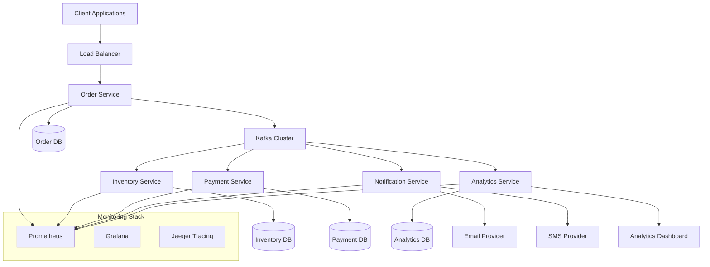
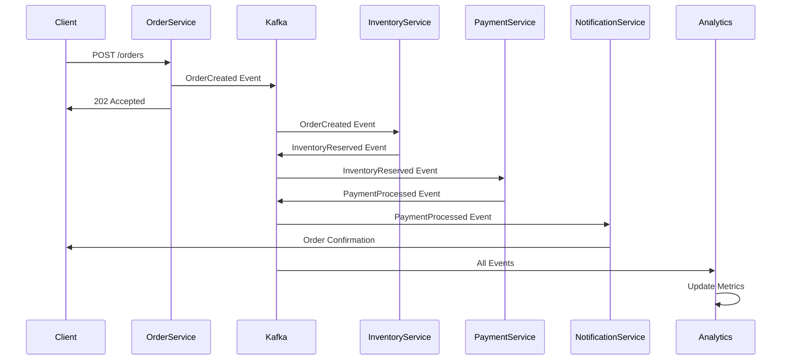

# Design Document

## Overview

The Real-Time E-commerce Order Processing System is a distributed microservices architecture built with Spring Boot and Apache Kafka. The system implements event-driven communication patterns, SAGA choreography for distributed transactions, and comprehensive observability. All components are containerized with Docker for easy deployment and scaling.

The system processes customer orders through a series of loosely coupled services that communicate via Kafka events, ensuring high availability, fault tolerance, and scalability.

## Architecture

### High-Level Architecture



### Event Flow Architecture



## Components and Interfaces

### 1. Order Service

**Responsibilities:**

- Expose REST API for order creation
- Validate order data
- Publish OrderCreated events
- Maintain order state and history

**Key Endpoints:**

- `POST /api/v1/orders` - Create new order
- `GET /api/v1/orders/{orderId}` - Get order details
- `GET /api/v1/orders/{orderId}/status` - Get order status
- `GET /health` - Health check endpoint

**Events Published:**

- `OrderCreated` - When a new order is successfully created

**Events Consumed:**

- `PaymentProcessed` - Updates order status to confirmed
- `PaymentFailed` - Updates order status to failed
- `InventoryInsufficient` - Updates order status to cancelled

### 2. Inventory Service

**Responsibilities:**

- Manage product inventory levels
- Reserve inventory for orders
- Release inventory on payment failures
- Handle inventory updates

**Events Published:**

- `InventoryReserved` - When inventory is successfully reserved
- `InventoryInsufficient` - When inventory is not available
- `InventoryReleased` - When reserved inventory is released

**Events Consumed:**

- `OrderCreated` - Triggers inventory reservation
- `PaymentFailed` - Triggers inventory release

### 3. Payment Service

**Responsibilities:**

- Process payments for orders
- Handle payment failures and retries
- Integrate with payment providers
- Manage payment state

**Events Published:**

- `PaymentProcessed` - When payment is successful
- `PaymentFailed` - When payment fails

**Events Consumed:**

- `InventoryReserved` - Triggers payment processing

### 4. Notification Service

**Responsibilities:**

- Send order confirmations
- Send shipping notifications
- Handle notification failures with retries
- Support multiple notification channels

**Events Published:**

- `NotificationSent` - When notification is successfully sent
- `NotificationFailed` - When notification fails

**Events Consumed:**

- `PaymentProcessed` - Triggers order confirmation
- `OrderShipped` - Triggers shipping notification
- `PaymentFailed` - Triggers failure notification

### 5. Analytics Service

**Responsibilities:**

- Process all events for real-time analytics
- Maintain business metrics
- Provide dashboard data
- Generate reports

**Events Consumed:**

- All events from other services for analytics processing

**Endpoints:**

- `GET /api/v1/analytics/dashboard` - Dashboard data
- `GET /api/v1/analytics/metrics` - System metrics

## Data Models

### Core Domain Events

```json
{
  "OrderCreated": {
    "eventId": "uuid",
    "orderId": "uuid",
    "customerId": "uuid",
    "items": [
      {
        "productId": "uuid",
        "quantity": "integer",
        "price": "decimal"
      }
    ],
    "totalAmount": "decimal",
    "timestamp": "datetime",
    "correlationId": "uuid"
  }
}
```

```json
{
  "InventoryReserved": {
    "eventId": "uuid",
    "orderId": "uuid",
    "reservations": [
      {
        "productId": "uuid",
        "quantity": "integer",
        "reservationId": "uuid"
      }
    ],
    "timestamp": "datetime",
    "correlationId": "uuid"
  }
}
```

```json
{
  "PaymentProcessed": {
    "eventId": "uuid",
    "orderId": "uuid",
    "paymentId": "uuid",
    "amount": "decimal",
    "paymentMethod": "string",
    "timestamp": "datetime",
    "correlationId": "uuid"
  }
}
```

### Database Schemas

**Order Service Database:**

```sql
CREATE TABLE orders (
    id UUID PRIMARY KEY,
    customer_id UUID NOT NULL,
    total_amount DECIMAL(10,2) NOT NULL,
    status VARCHAR(50) NOT NULL,
    created_at TIMESTAMP DEFAULT CURRENT_TIMESTAMP,
    updated_at TIMESTAMP DEFAULT CURRENT_TIMESTAMP
);

CREATE TABLE order_items (
    id UUID PRIMARY KEY,
    order_id UUID REFERENCES orders(id),
    product_id UUID NOT NULL,
    quantity INTEGER NOT NULL,
    price DECIMAL(10,2) NOT NULL
);
```

**Inventory Service Database:**

```sql
CREATE TABLE products (
    id UUID PRIMARY KEY,
    name VARCHAR(255) NOT NULL,
    available_quantity INTEGER NOT NULL,
    reserved_quantity INTEGER DEFAULT 0,
    price DECIMAL(10,2) NOT NULL
);

CREATE TABLE inventory_reservations (
    id UUID PRIMARY KEY,
    order_id UUID NOT NULL,
    product_id UUID REFERENCES products(id),
    quantity INTEGER NOT NULL,
    status VARCHAR(50) NOT NULL,
    created_at TIMESTAMP DEFAULT CURRENT_TIMESTAMP
);
```

## Error Handling

### SAGA Compensation Pattern

The system implements choreography-based SAGA pattern for handling distributed transaction failures:

**Happy Path:**

1. OrderCreated → InventoryReserved → PaymentProcessed → NotificationSent

**Compensation Flows:**

**Inventory Insufficient:**

1. OrderCreated → InventoryInsufficient → OrderCancelled

**Payment Failed:**

1. OrderCreated → InventoryReserved → PaymentFailed → InventoryReleased → OrderFailed

**Notification Failed:**

1. PaymentProcessed → NotificationFailed → NotificationRetry (with exponential backoff)

### Dead Letter Queue Strategy

Each service implements DLQ handling for unprocessable messages:

- **Retry Policy**: 3 attempts with exponential backoff (1s, 2s, 4s)
- **DLQ Routing**: Failed messages routed to `{topic-name}.DLQ`
- **Manual Recovery**: Admin interface for DLQ message inspection and reprocessing

### Circuit Breaker Pattern

External service calls (payment providers, notification services) implement circuit breaker:

- **Failure Threshold**: 5 failures in 60 seconds
- **Open Duration**: 30 seconds
- **Half-Open**: Allow 1 test request after timeout

## Testing Strategy

### Unit Testing

- **Coverage Target**: 90% code coverage
- **Framework**: JUnit 5 + Mockito
- **Focus Areas**: Business logic, event handling, data validation

### Integration Testing

- **Framework**: Spring Boot Test + Testcontainers
- **Kafka Testing**: Embedded Kafka for integration tests
- **Database Testing**: H2 in-memory database for fast tests

### Contract Testing

- **Framework**: Spring Cloud Contract
- **Event Contracts**: Define event schemas and validate compatibility
- **API Contracts**: REST API contract testing between services

### End-to-End Testing

- **Framework**: Docker Compose + Newman/Postman
- **Scenarios**: Complete order flows including failure scenarios
- **Performance Testing**: Load testing with realistic traffic patterns

### Chaos Engineering

- **Framework**: Chaos Monkey for Spring Boot
- **Scenarios**: Random service failures, network partitions, database failures
- **Monitoring**: Verify system resilience and recovery

## Deployment Architecture

### Docker Containerization

Each service runs in its own Docker container with:

- **Base Image**: OpenJDK 17 Alpine
- **Health Checks**: Spring Boot Actuator endpoints
- **Resource Limits**: CPU and memory constraints
- **Security**: Non-root user, minimal attack surface

### Docker Compose Configuration

```yaml
version: '3.8'
services:
  zookeeper:
    image: confluentinc/cp-zookeeper:latest
    environment:
      ZOOKEEPER_CLIENT_PORT: 2181

  kafka:
    image: confluentinc/cp-kafka:latest
    depends_on: [zookeeper]
    environment:
      KAFKA_BROKER_ID: 1
      KAFKA_ZOOKEEPER_CONNECT: zookeeper:2181
      KAFKA_ADVERTISED_LISTENERS: PLAINTEXT://kafka:9092

  order-service:
    build: ./order-service
    depends_on: [kafka, order-db]
    environment:
      SPRING_KAFKA_BOOTSTRAP_SERVERS: kafka:9092
      SPRING_DATASOURCE_URL: jdbc:postgresql://order-db:5432/orders

  # Additional services...
```

### Monitoring and Observability

**Metrics Collection:**

- **Prometheus**: Metrics scraping from all services
- **Grafana**: Dashboards for business and technical metrics
- **Custom Metrics**: Order processing rates, error rates, latency percentiles

**Distributed Tracing:**

- **Jaeger**: End-to-end request tracing
- **Correlation IDs**: Track requests across service boundaries
- **Kafka Headers**: Propagate trace context through events

**Logging:**

- **Structured Logging**: JSON format with correlation IDs
- **Log Aggregation**: Centralized logging with ELK stack
- **Log Levels**: Configurable per service and environment

**Health Monitoring:**

- **Spring Boot Actuator**: Health, metrics, and info endpoints
- **Liveness Probes**: Container health checks
- **Readiness Probes**: Service readiness verification
